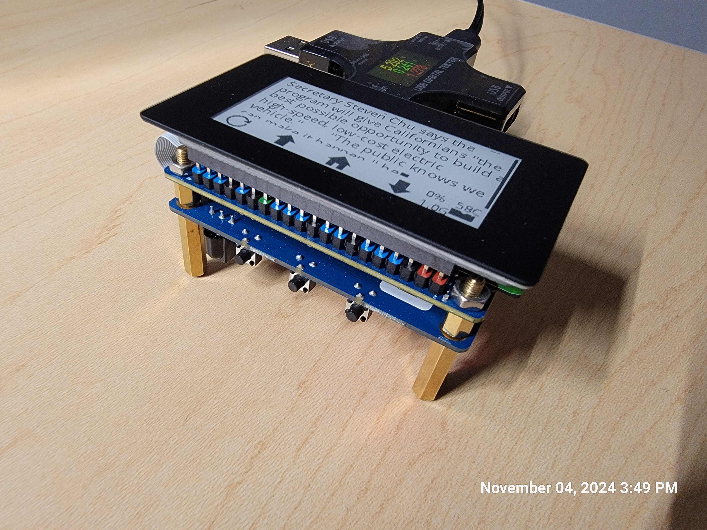

## ePaper UI for Rendering LLM Inference on Pi Zero

This project is a simple ePaper UI for rendering LLM inference results on a Pi Zero. 
The UI is designed to be simple and low power, with a focus on readability and minimalism. The UI is designed to be used with the [RWKV](https://pypi.org/project/rwkv/) library, but can be easily adapted to other LLM inference libraries.



https://raw.githubusercontent.com/fxlin/llm-pi-zero/main/rwkv-demo-powermeter.mp4

## Hardware

- Orange Pi Zero 2W (4GB) - $35 [Amazon](https://www.amazon.com/gp/product/B0CHM7HN8P/ref=ppx_yo_dt_b_asin_title_o00_s00?ie=UTF8&th=1)
- Waveshare 2.13inch Touch e-Paper Display - $27 [Amazon](https://www.amazon.com/dp/B0BZDVZ7NR?ref=ppx_yo2ov_dt_b_fed_asin_title&th=1)
  - 2in13_V4, 250x122
  - https://www.waveshare.com/wiki/2.13inch_Touch_e-Paper_HAT_Manual

Whole system ~= 2.5 Watt when busy, ~= 1 Watt when idle (can be optimized)

**Total:** ~$65

While the ePaper is not specifically designed for the Orange Pi, it has good pin compatibility with the Raspberry Pi Zero 2W. Most changes involve adjusting the SPI (for display) and I2C (for touch) bus numbers. Refer to `epdconfig_ori.py` for details.

### Optional

- Orange Pi Zero 2W Extension Board - $15 [Amazon](https://www.amazon.com/gp/product/B0CHMTT4XP/ref=ppx_yo_dt_b_asin_title_o00_s00?ie=UTF8&th=1) - For ease of development
- USB Power Tester - $20 [Amazon](https://www.amazon.com/dp/B07JYVPLLJ?ref=ppx_yo2ov_dt_b_fed_asin_title)


### TODO

- **Raspberry Pi Zero 2W** - Should work, but untested


## Software

Use orangepi-config or raspi-config to enable SPI and I2C accesses.

### Run All Commands Below as Root

```
sudo su
```

reason: wiringpi (see below) requires root to work
(tried non root, tedious. not worth the effort)

### Initialization python virtual env

```
apt-get install python3-dev
python3 -m venv rootenv
source rootenv/bin/activate
```

### verify pip is good
````
which pip
# should point to rootenv/
````

## install wiringpi (with opi customizations)
For accessing GPIO of opi0. 

**CANNOT DO THIS** ~~pip3 install wiringpi~~

must build from source, which is much newer (4.0.2)

cf "3.21. How to install and use wiringOP-Python" manual pp 166, briefly

```
apt-get -y install git swig python3-dev python3-setuptools

git clone --recursive https://github.com/orangepi-xunlong/wiringOP-Python -b next
cd wiringOP-Python
git submodule update --init --remote
python3 generate-bindings.py > bindings.i
python3 setup.py install
```

### check wiringpi
```
python3 -c "import wiringpi; help(wiringpi)"
#should show version 4.0.2
```

```
python3 -c "import wiringpi; \
from wiringpi import GPIO; wiringpi.wiringPiSetup() ; \
wiringpi.pinMode(2, GPIO.OUTPUT) ; "
# shouldn't see any errors, e.g. complain about gpio access right 
```

### install other dependneices 
```
pip install spidev
pip install gpiozero
pip install lgpio
pip install psutil
pip install Pillow
pip install smbus
```

### install the epaper lib (dev mode)

```
cd llm-epaper-demo
```

```
pip install -e Touch_e-Paper_Code/python
```

### test the UI without any LLM

```
EMU=1 python3 pi-demo.py
```
will send a hardcoded message to the UI for rendering.


### test the UI with LLM

#### RWKV
```
pip install torch
# https://pypi.org/project/rwkv/
pip install rwkv
```

Download a model from Hugging Face(https://huggingface.co/BlinkDL) like this one (https://huggingface.co/BlinkDL/rwkv-4-pile-169m/blob/main/RWKV-4-Pile-169M-20220807-8023.pth).

My model paths are /data/models/pi-deployment/ 

## Finish up

Enable the service to start on boot
```
cp pi-demo.service /etc/systemd/system/
systemctl enable pi-demo
# launch it right now
systemctl start myscript.service
```

